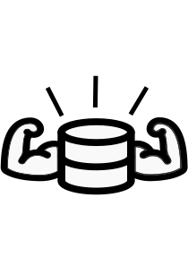

# Oh My DB 🚀

**Oh My DB** adalah alat bantu perancangan skema database visual yang dirancang untuk kecepatan, kemudahan, dan pembelajaran. Bangun skema database kamu tanpa harus menyentuh kode SQL di awal, lalu ekspor ke format yang kamu butuhkan.



## ✨ Fitur Utama

- 🎨 **Visual Table Builder**: Tambah dan kelola tabel/kolom dengan antarmuka yang bersih.
- 🖱️ **Drag & Drop**: Atur ulang urutan tabel dan kolom dengan mudah.
- ⏪ **Undo & Redo**: Jangan takut salah, sistem history lengkap dengan shortcut (Ctrl+Z / Ctrl+Y).
- 🐘 **Laravel Ready**: Ekspor skema kamu langsung menjadi file **Laravel Migration** dan **Seeder**.
- 🛠️ **Smart Type Detection**: Deteksi tipe data otomatis berdasarkan nama kolom (email, id, price, dll).
- 📊 **Live Data Preview**: Lihat contoh data dummy secara langsung untuk membayangkan isi database.
- 🖼️ **Image Export**: Simpan rancangan kamu sebagai file gambar PNG untuk laporan atau presentasi.
- 💾 **No Login Required**: Semua data disimpan di `LocalStorage` browser kamu. Aman dan privat.

## 🚀 Memulai Proyek

### Instalasi

1. Clone repositori ini:
   ```bash
   git clone https://github.com/username/oh-my-db.git
   ```
2. Masuk ke folder proyek:
   ```bash
   cd oh-my-db
   ```
3. Instal dependensi:
   ```bash
   npm install
   ```

### Pengembangan

Jalankan server lokal untuk mulai coding:
```bash
npm run dev
```

### Build untuk Produksi

Buat file statis yang siap di-hosting:
```bash
npm run build
```

## 🛠️ Dibangun Dengan

- [Vue 3](https://vuejs.org/) - The Progressive JavaScript Framework.
- [Pinia](https://pinia.vuejs.org/) - State management yang intuitif.
- [Tailwind CSS](https://tailwindcss.com/) - Untuk styling yang cepat dan modern.
- [Lucide Icons](https://lucide.dev/) - Ikon yang cantik dan konsisten.
- [vuedraggable](https://github.com/SortableJS/vue.draggable.next) - Library Drag & Drop.

## 📄 Lisensi

Proyek ini berada di bawah lisensi MIT. Silakan gunakan untuk keperluan belajar atau proyek kamu sendiri!

---
Dibuat dengan ❤️ untuk membantu pengembang dan pelajar database.
